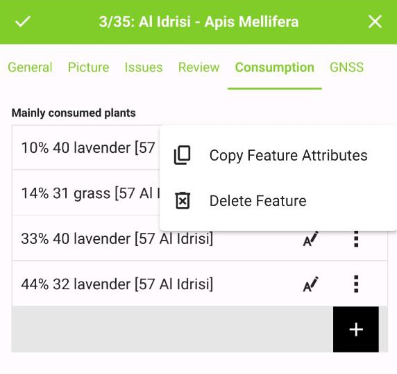
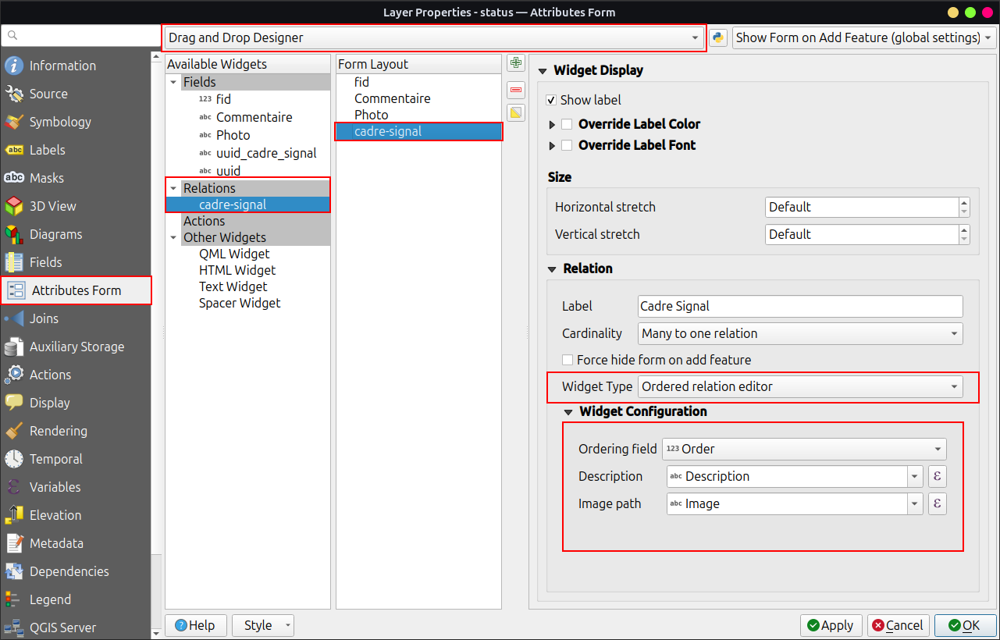
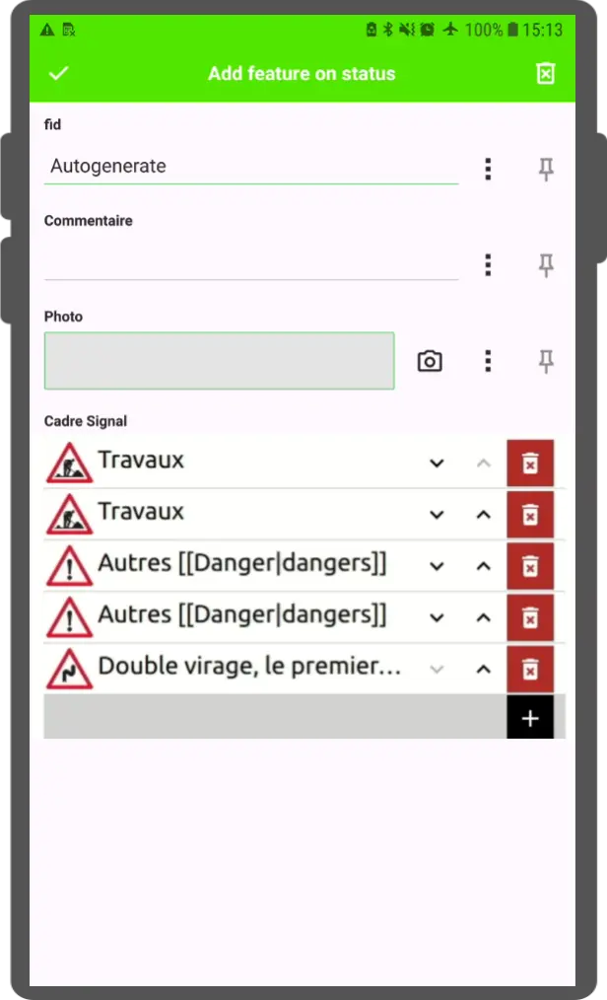
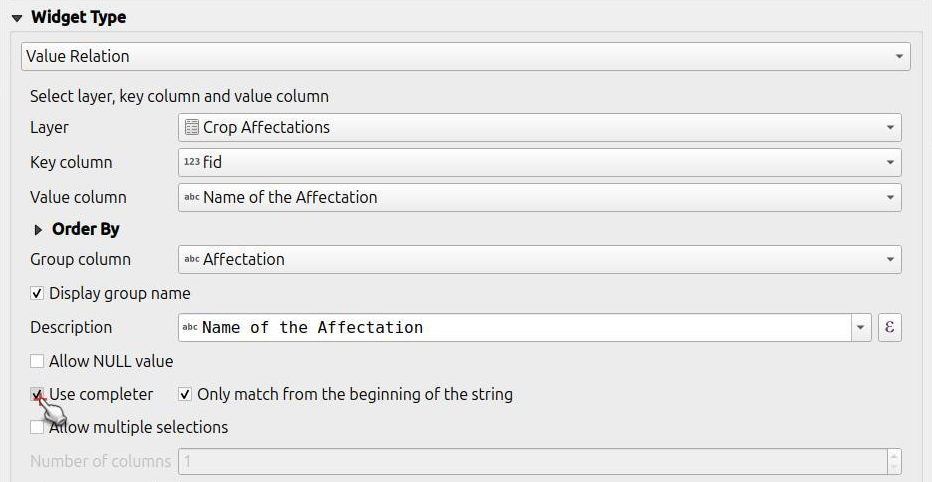
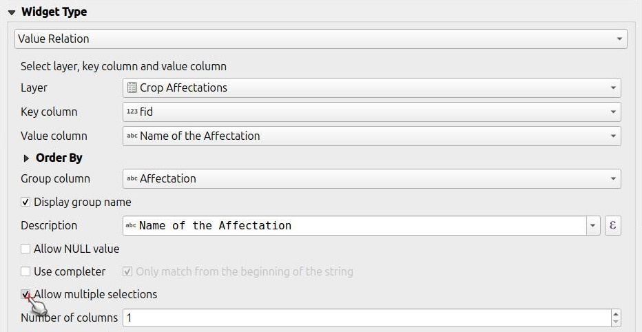
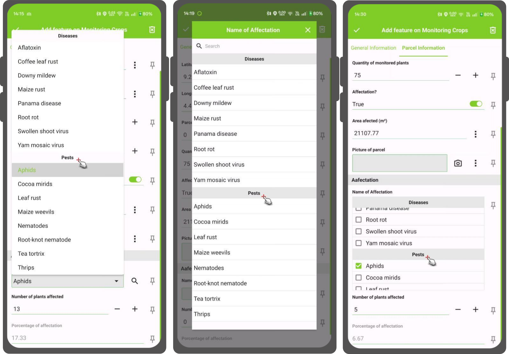
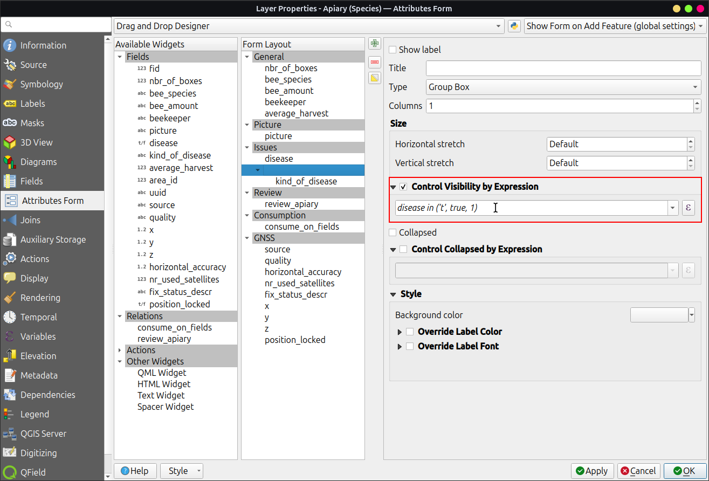
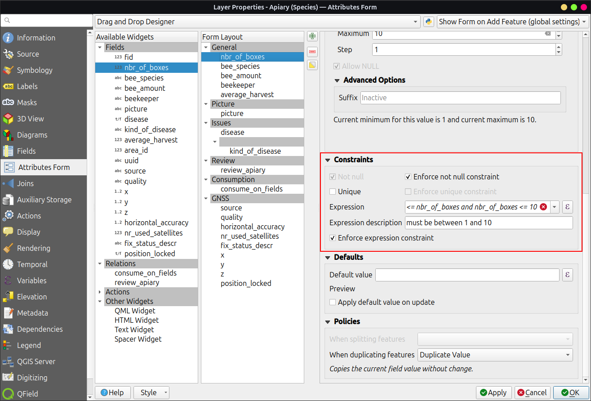

# Attribute form

QField creates forms that are similar to QGIS, but with some differences.
QGIS field widgets are supported on a best-effort basis and optimized for mobile use.


| Widget type        | Support          | Notes                                                                                                                                                                                                  |
|--------------------|------------------|--------------------------------------------------------------------------------------------------------------------------------------------------------------------------------------------------------|
| Text Edit          | :material-check: | - HTML is not supported <br> - Numeric input is enforced based on the field type.                                                                                                                          |
| Check Box          | :material-check: |                                                                                                                                                                                                        |
| Value Map          | :material-check: |                                                                                                                                                                                                        |
| Hidden             | :material-check: |                                                                                                                                                                                                        |
| Attachment         | :material-check: | This field is combined with camera integration. It is also able to open other files like pdf and doc (if you have an appropriate viewer) [Attachment (photo settings)](#configurable-attachment-path) |
| Date Time          | :material-check: |                                                                                                                                                                                                        |
| Range              | :material-check: |                                                                                                                                                                                                        |
| Relation Reference | :material-check: |                                                                                                                                                                                                        |
| Relation Widget    | :material-check: |                                                                                                                                                                                                        |
| Value Relation     | :material-check: |                                                                                                                                                                                                        |
| UUID Generator     | :material-check: |                                                                                                                                                                                                        |
| QML / HTML Widget  | :material-check: |                                                                                                                                                                                                        |
| Others             | :material-close: | [Funding](../get-started/support.md#development-and-custom-apps)                                                                                                                                      |

### Editable

The *editable* flag of fields is respected.

### Remember last values

QField offers more fine-grained control over the last used values than QGIS,
and uses its own settings instead of the QGIS ones.

### Suppress attribute form

The setting *suppress attribute form* is directly applied to the
QField form.

### Drag and drop designer forms

Groups and Tabs from Drag and Drop designer forms are supported.

In the "Attributes Form," you can structure your forms using various containers, such as tabs and groups, and enhance interactivity by incorporating expression-based conditional visibility. By enabling the [Drag and Drop Designer](https://docs.qgis.org/latest/en/docs/user_manual/working_with_vector/vector_properties.html#vector-attributes-menu), you gain the flexibility to re-order attribute fields, as well as gaining access to widgets that are not directly tied to specific fields (e.g., HTML/QML widgets).

!

!

## Configure a Relation Widget
:material-monitor: Desktop preparation

For detailed information on setting up data layer relationships in QGIS, please refer to the [Setting relations between multiple layers](https://docs.qgis.org/latest/en/docs/user_manual/working_with_vector/joins_relations.html#setting-relations-between-multiple-layers) QGIS documentation. To then control how many related items are shown in QField, see the instructions for Configuring [Maximum items visibility for QField](../get-started/tutorials/get-started-qfs.md#configuring-maximum-items-visibility-for-qfield).

!

The relation widget shows all the referencing child features in a list.
It is possible to add, delete and open them.

The visual identification of the list entries are done via the *Display Expression* of the child layer.

### Key handling

Since the parent's primary keys are used as foreign keys in the
referencing child features, these primary keys must be safe to use even
after synchronizing back to the original data. Therefore we
recommend to use stable values such as UUIDs for primary keys.

It is possible to already add children from a parent that is about to be
added. This possibility will be blocked if there is no valid primary key
on the parent or the constraints are violated. In case the adding of the
parent feature is canceled after some children have been added already,
the children are deleted as well.

### Many-To-Many relations

On many-to-many relationships, according to the cardinality setting in
the *QGIS Vector Layer Properties*, on adding, deleting or opening an
entry in the list effects directly the child layer (on direct
cardinality) or the linking table (on many-to-one cardinality).

The second case is usually used when there are additional relation
information (e.g. percentage) in the linking table.

!

In case of the many-to-one cardinality on many-to-many relations the
*Display Expression* needs to be set on the linking table.

### Configuring Ordered Relations for QGIS and QField

The **Ordered Relation Editor** widget enables reordering of linked child features based on a specific ordering field.

#### 1. Install the Plugin

Make sure you have installed the [Ordered Relation Editor](https://github.com/opengisch/qgis-ordered-relation-editor) plugin from the official repository or through the "Plugin Manager" in QGIS.

#### 2. Configure the Layout

Navigate to the **Attributes Form** section of your layer settings and set the layout editor to **Drag and Drop Designer**.

#### 3. Set Up the Relation Editor Widget

In the **Relation** widget type dropdown, select **Ordered Relation Editor**. Then, configure the widget using the following settings:

- **Ordering Field**: Specify the field in the child layer that will be used to determine the order of the features.

- **Description**: Define an expression to display descriptive text for each child feature in the list.

- **Image Path (Optional)**: Provide a path to an image or icon to visually enhance the list. This is an expression that resolves dynamically.

!

!

### Item Threshold Configuration for Value Map Editor Widgets

To enhance the user experience within QField, it is possible to control the item threshold at which point the value map editor widgets switch to a toggle buttons interface.
This feature allows users to quickly access items in QField when there are few and providing a more intuitive interface when dealing with a large number of items.

#### To Activate Toggle Button Interface

1. Open **Layer Properties** by right-clicking on the desired layer and selecting 'Properties' from the context menu.

2. Navigate to the **QField** tab located within the Layer Properties dialog.

3. Here, you will find an option to specify the quantity of items that will trigger the transition to a toggle button interface.
Enter the preferred threshold value according to your needs.

!

!

!

## Configure Attachment Widget
:material-monitor: Desktop preparation

The widget type *Attachment* is used with fields that store the path
to files.

It can be used to:

- show and take photos or add pictures from the gallery
- listen and record sound clips
- show and record videos
- show links to external files like PDFs or documents

!

!

!

The path should be set to relative. The pictures, audios, videos, pdf and docs are
stored then in a sub-directory of the project, where the link stored in
the textfield is pointing to.

!!! note
    QGIS 3.30 or newer is required for the audio and video functionality

In QField the attachments are displayed. By clicking the icons symbol the camera or audio record is started to update the pictures, videos or audios with a new media.

!

On synchronization the sub-directory with the pictures, videos audios, pdf and docs has to be copied as well.

The option *hyperlink* on the attachment widget will disable the
camera functionality and enable a hyperlink to open a document (pdf,
doc, \...).


## Configurable attachment path
:material-monitor: Desktop preparation

QFieldSync provides the possibility to configure the path of attachments.

- Go to _QFieldSync plugin > Layers Properties_

Use expressions to specify the path of the attachments. By default, pictures are saved into the "DCIM" folder, audio recordings are saved into the "audio" folder and videos are saved into "video" with a timestamp as name.

!

## Configure a Value Relation Widget
:material-monitor: Desktop preparation

The widget *Value Relation* offers values from a related table in a
combobox. You can select *layer*, *key column* and *value column*. Several
options are available to change the standard behaviors: *allow null value*, *order by value* and *allow multiple selections*. The widget will
display a drop-down or multiple-select list of the referenced features.

!


### Group Values in the Value Relation Widget

Enhance the organization and usability of your *Value Relation widgets* by grouping related items. This feature allows you to categorize the values in the dropdown list and table view based on the content of a chosen column.

For example, if you have a list of cities, you can group them by their respective states. This makes it easier for users to navigate and find the values they need, especially in lists with a large number of items.

#### Configuration

Grouping is configured within the Value Relation widget's settings using the following options:

- **Group column**: Choose the column from the related layer that will be used to organize the items. The values from this column will act as the group titles.
- **Display group name**: Check this box to display the group titles as distinct headers within the widget. This creates a clear visual separation between the different groups, making the list easier to navigate.

!

!

!

!

## Configure Conditional Visibility
:material-monitor: Desktop preparation

Groups can be hidden based on an expression. This is useful when certain
attributes are only required under certain conditions. As an example
imagine mapping trees. Some of them might have a disease and you have a
list of possible deseases. To not clutter the form with many fields,
make a group and configure a visibility expression for a group
"diseases". Add a field "desease" with a checkbox. Only when the
checkbox is checked, the list of diseases will be available to you.

!

Let's see what we got on the field:

!


## Define Constraints
:material-monitor: Desktop preparation

Attribute fields can have constraints attached. Constraints are
expressions that needs to evaluate to `True` (or `1`) in order to be
able to save the form. Constraints are configured on a per-field basis
and a description can be added that will be shown if a
constraint is not satisfied.

!

### Common use cases

You cannot enter an elevation value higher than the highest mountain in
this country.

``` sql
"elevation" < 5000
```

It is required to fill in an identifier.

``` sql
"identifier" IS NOT NULL
```

## Define Default Values
:material-monitor: Desktop preparation

Fields can have default values configured. Default values are inserted
into the attribute form when digitizing a new feature. They are visible and can be modified as long as the field is editable. They
can be based on the geometry or expression variables.

!

When creating expressions for projects intended to be used with QField, it is recommended to use layer names rather than layer IDs. This recommendation stems from the fact that during the project conversion process via QFieldSync, the resulting layers may receive different IDs, which can lead to incorrect expression evaluations. By using layer names, you ensure that expressions are evaluated consistently and accurately across different project states.

!

### Additional variables

For more information regarding storing information related to your
position in object attributes, refer to the deticated
[GNSS documentation](./gnss.md).

For QFieldCloud users, two variables can be used in expressions including attribute form's default values:
- `@cloud_username` which returns the  name of the currently logged in QFieldCloud user.
- `@cloud_useremail` which returns the email address of the currently logged in QFieldCloud user.

### Common use cases

Insert positioning information as variable:

``` sql
@position_horizontal_accuracy
```

Insert the current date and time:

``` sql
now()
```

Insert the length of the digitized line:

``` sql
length($geometry)
```

Configure global variables on the device and insert them.

``` sql
@operator_name
```

If you want to assign a region code based on the location where a new
feature is inserted, you can do so by using an aggregate expression:

``` sql
aggregate( layer:='regions', aggregate:='max', expression:="code", filter:=intersects( $geometry, geometry( @parent ) ) )
```

To transform the coordinates received from \@position_coordinate to the
coordinate system of your project:

``` sql
x(transform(@position_coordinate, 'EPSG:4326', @project_crs ))
y(transform(@position_coordinate, 'EPSG:4326', @project_crs ))
```

::: {#snapping_results}
If you want to use the snapping results after drawing a line, you can
use the [\@snapping_results]{.title-ref} variable. The following code
extracts the value of the attribute [id]{.title-ref} of the snapping
match of the first point of a line.
:::

``` sql
with_variable(
  'first_snapped_point',
  array_first( @snapping_results ),
  attribute(
    get_feature_by_id(
      @first_snapped_point['layer'],
      @first_snapped_point['feature_id']
    ),
    'id'
  )
)
```

## Search in value relation and relation reference widget

It is possible to search value in a *value relation* or *relation reference* widget using the magnifying
glass next to the field.

!

!!! note
    Define the *display expression* for the concerned layers, this will
    be used for searching for features. This is configured under
    *Vector Layer Properties > Display*

## Configure Auto-complete Value
:material-monitor: Desktop preparation

The "Use completer" checkbox must be checked to be able to use the
auto-complete in the value relation.

!

Here a video showing how it works on QField

!

## Define QML Widgets

Custom QML widgets can be useful to integrate advanced actions into forms.
In this example we define add a button that open a third-party map and navigation app.
This is useful to open e.g. turn-by-turn navigations on the device-native app for the user.

```qml
import QtQuick 2.0
import QtQuick.Controls 2.0

Button {
    width: 200
    height: width/5
    text: "Open in Maps"
    onClicked: {
        Qt.openUrlExternally(expression.evaluate("'geo:0,0?q=' || $y || ',' || $x"));
    }
}
```

The `geo` URI above is adapted to work with Android. For Apple Maps the URI can be changed to `'geo:' || $y || ',' || $x`.


