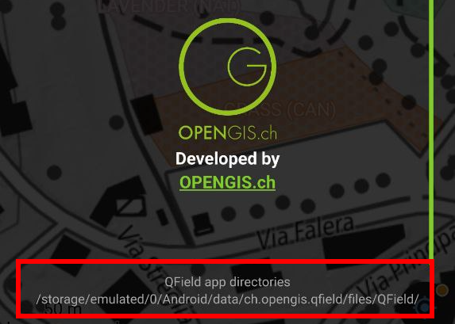
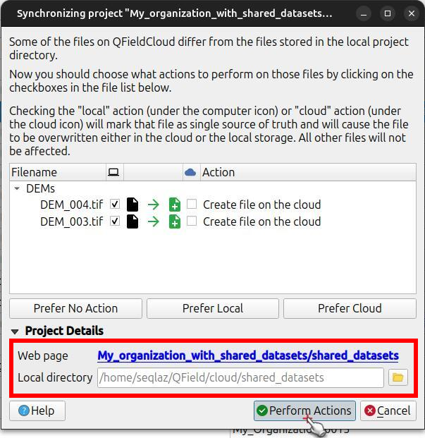

# Shared datasets

It is possible to use layers stored in a single location — referred to as a 'localized data path' — across multiple projects.

This can help to reduce storage requirements for large datasets such as orthophoto raster files, land use vector files, etc., as well as ease the management of dataset updates.

There are two possibilities to share data across projects:

- Manual transfer: The to be shared datasets are manually copied to the devices
- Synchronisation through QFieldCloud: The to be shared datasets are uploaded and stored in a dedicated location on QFieldCloud accessible to the pre-configured projects.

## Managing Localized Data Paths in QGIS

:material-monitor: Desktop preparation

When preparing a new project for QField, make sure the datasets you want to share across multiple projects are stored within the localized data path in QGIS.

- In QGIS direct to **Settings > Options > Data Sources**
- Under the 'Localized Data Paths' section add the necessary path where the datasets to be shared are located.
Once correctly added, QGIS, QField/QFieldCloud will treat them as shareable datasets.

!

## Manual configuration on portable device in QField

To transfer the shared datasets manually in QField, the datasets have to be added into the right directory on your device:

- In QField, open a project.
- Reveal the side legend by clicking on the icon with the three lines, and open the main menu by clicking on the 3-dotted button.
- Select the 'About QField' menu tab.
- The application directory locations will be displayed at the bottom of the screen just below the 'App directories' path (the paths differ depending on the operating system).
- Copy your shared dataset files into the directory `[App Directory]/QField/basemaps` on your device.
QField will automatically scan this folder for basemaps and other recognizable data.

!

## Configuration of shareable datasets with QFieldCloud

QFieldCloud eases the management of shared datasets used in multiple projects recognising the QGIS localized data settings.
Uploaded cloud projects reference the shared datasets stored in a designated QFieldCloud project named **`shared_datasets`**.
This special type of project can be created by the user in advance or is automatically created during a file upload using QFieldSync.

The file structure within the **`shared_datasets`** project will reflect the structure of the localized path from which the datasets originate.
For example, if your QGIS Localized Data Path is `./GIS_Common/BaseData/` and you have a file `./GIS_Common/BaseData/Administrative-boundaries.gpkg`, it will appear as `Administrative-boundaries.gpkg` within the **`shared_datasets`** cloud project.

!!! note
    Only collaborators whose user role is “manager” or “admin” (directly assigned or as organization owners or admin) can add files to the **`shared_datasets`** project.

### Preparation of a QGIS Project containing shared datasets

**Follow the same [Desktop Preparation (QGIS)](#managing-localized-data-paths-in-qgis)** steps outlined above.

- Make sure the Localized Data Paths in QGIS are correctly configured to point to the location of the shared datasets on your computer.
This tells QFieldSync which files to treat as "localized" for cloud handling.
- Ensure your shared layers are part of your QGIS project and their paths are relative to one of the configured localized data paths.

### Upload of shared datasets to QFieldCloud

#### Synchronization with QFieldSync

- In QGIS, open your project and use the QFieldSync plugin to upload to or synchronize with QFieldCloud.
- At the beginning of the synchronization process, you will see a new **Upload missing localized dataset(s)** checkbox.
Ensure this option is checked.
If you hover over the checkbox, you will see the list of files that will be uploaded.
This checkbox is only available for users with the permission to add files to the **`shared_datasets`** project.

!

- Click on the **Perform Actions** button to proceed.
During the upload phase, a list of the shared and regular project datasets will appear as they are being transferred.
This instructs QFieldSync to find the actual data files referenced by your Localized Data Paths and upload them to the **`shared_datasets`** cloud project.

#### Review of the Upload Log

After the synchronization is complete, you can check the QFieldSync log.
It will detail the files uploaded, including the shared datasets that were sent to QFieldCloud.

!

### Localization of datasets within the QFieldCloud web interface

Once uploaded, these shared datasets will appear in two key places on the QFieldCloud web interface:

- Within the dedicated **`shared_datasets`** project itself.
- Referenced in the **Files** tab of any regular cloud project that utilizes them.

#### Shared datasets in cloud projects

- Open your project in the QFieldCloud web interface.
- Go to the **Files** tab.
- You will find a section named **Shared datasets**.
This dialogue lists all datasets that have been identified and uploaded as shared/localized resources for your projects.

!

#### Checking the dataset status

For any cloud project containing shared datasets, QFieldCloud’s web interface will indicate those missing on the cloud (i.e., referenced by any project but have not yet been uploaded into the **`shared_datasets`** project) using a red color.

This can be fixed by synchronizing the project again from QGIS with QFieldSync, ensuring the "Upload missing localized dataset(s)" option is checked [Synchronization with QFieldSync](#synchronization-with-qfieldsync)).
Alternatively, if you have the necessary permissions, you can manage the **`shared_datasets`** project directly (see section [Synchronizing directly the shared_datasets project](#direct-synchronization-in-the-shared_datasets-project)).

Similarly, if you prepare a new QGIS project to use shared files that are *already present* in your QFieldCloud **`shared_datasets`** project, QFieldSync will recognize this.
The "Upload missing localized dataset(s)" checkbox should not appear. If it does, QFieldSync will not re-upload datasets that already exist and are up-to-date in the **`shared_datasets`** project.

### Shared datasets in QField

Users can simply download the projects to QField or synchronize pre-existing ones to access the shared datasets.
A key benefit is that the download of these shared localized datasets is managed efficiently by QField.
Each shared dataset will only be downloaded **once**, even if multiple projects use it.
This saves storage space and synchronization time.

!

### Direct synchronization in the **`shared_datasets`** project

Instead of relying on individual project synchronization to populate the **`shared_datasets`** project, users with the right permissions can manage its content more directly.

#### With QFieldSync

Users with 'manager' or 'admin' permissions for the **`shared_datasets`** project can manage its content directly using QFieldSync:

1.  In QFieldSync, download the **`shared_datasets`** project from QFieldCloud to a local directory on your computer.
2.  You can now add, update, or remove files within the preconfigured file directory of the localized datasets.
3.  Use QFieldSync (with the **`shared_datasets`** project selected) to synchronize these changes directly back to the cloud.

!!!note
    The specific user roles must be set for the **`shared_datasets`** project as for any other project.
    A collaborator with an admin role of a project making use of a shared dataset will not automatically have the permission for the **`shared_datasets`** project.

!

!

#### With the QFieldCloud-CLI

Administrators can further automate the synchronization of the **`shared_datasets`** project by using QFieldCloud’s official CLI tool, `qfieldcloud-cli` (which is part of the [qfieldcloud-sdk](https://pypi.org/project/qfieldcloud-sdk/) Python package).

The tool can be used to synchronize QFieldCloud files from a local directory.
It automatically checks if there is a version change of the file contents.

- [Login to QFieldCloud](https://opengisch.github.io/qfieldcloud-sdk-python/examples/#log-in-to-qfieldcloud) using the CLI

```console
$ qfieldcloud-cli login USER PASSWORD
Log in super_user…
Welcome to QFieldCloud, USER.
QFieldCloud has generated a secret token to identify you. Put the token in your in the environment using the following code, so you do not need to write your username and password again:
export QFIELDCLOUD_TOKEN="TOKEN_HERE"
$ export QFIELDCLOUD_TOKEN="TOKEN_HERE"
```

- [List the QFieldCloud projects](https://opengisch.github.io/qfieldcloud-sdk-python/examples/#list-your-projects) and get the project ID of the **`shared_datasets`** project:

```console
$ qfieldcloud-cli list-projects
Listing projects…
Projects the current user has access to:
| ID                                   | OWNER/NAME           | IS PUBLIC |
---------------------------------------------------------------------------
| 90e83606-dce8-4b0d-854a-388904d8a739 | USER/shared_datasets | 0         |
```

!!! note
    Your project ID will be different

[Upload the shared datasets](https://opengisch.github.io/qfieldcloud-sdk-python/examples/#upload-local-files-to-qfieldcloud) from your local source directory to the **`shared_datasets`** project:

```console
qfieldcloud-cli upload-files 'YOUR_PROJECT_ID' "./path/to/your/local/shared/data/"
```

You can set up this [command as a regular cronjob that runs periodically](https://opengisch.github.io/qfieldcloud-sdk-python/examples/#schedule-and-trigger-a-package-job) (e.g., daily), or trigger it manually based on other conditions, to keep your shared datasets on QFieldCloud up-to-date.
