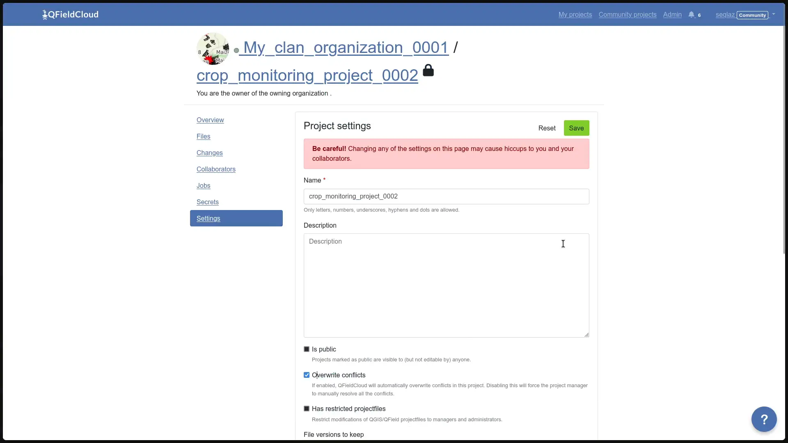

## Understanding Conflicts in Data Synchronization

Conflicts occur when any of these conditions is met:

1) distinct users set the same attribute on the same feature to different values;
2) a primary key is employed twice.
While highly unlikely have conflicts, preventing, mitigating and resolving conflicts is important to maintain data integrity in a healthy QGIS project. Here are some tips and tricks to do just that.

### How to Avoid Conflicts?

1. **Unique "fid" Serial Numbers:**
   - When creating a feature, it is recommended to assign a unique "fid" serial number to each feature in the layers.
   - Use the expression "epoch(now())" (without the double quote) in the "fid" to generate a unique identifier per millisecond, reducing the possibility of duplicate "fid" numbers.

2. **Planning and Designation:**
   - For updating existing features based on field conditions, plan and designate the features each user will update.
   - Users should avoid changing the "fid" or identifier numbers.

### How to Resolve Conflicts?

- By default, QFieldCloud overwrites conflicts using a _last wins_ policy (the latest patch of changes to the attribute(s) involved in the conflict replaces all earlier patches of changes to these attributes). Alternatively, admins can set a project's conflict resolution policy to _manual_. Doing so will require the project manager to manually resolve conflicts, picking those to be applied to the project.

- When dealing with conflicts:
   - Navigate to the "Changes" section.
   - Filter the changes with the "Conflict" status.
   - For each conflicted change, select it and set the status to "Re-apply" from the "Action" dropdown menu, alternatively if all the new changes are in conflict you can choose in the last conflicted change and select "Re-apply this and newer changes".
   - Check the details of changes in the conflict and click "Save All" at the end of the page.
   - Refer to our official documentation [Delta apply](https://docs.qfield.org/reference/qfieldcloud/jobs/#delta-apply-delta_apply-job) for additional information.

!
